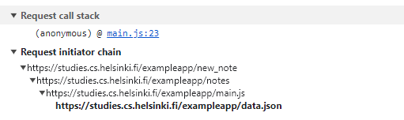

sequenceDiagram
participant browser
participant server
participant user

    browser->>server: GET https://studies.cs.helsinki.fi/exampleapp/notes
    activate server
    server-->>browser: HTML document
    deactivate server

    browser->>server: GET https://studies.cs.helsinki.fi/exampleapp/main.css
    activate server
    server-->>browser: the css file
    deactivate server

    browser->>server: GET https://studies.cs.helsinki.fi/exampleapp/main.js
    activate server
    server-->>browser: the JavaScript file
    deactivate server

    Note right of browser: The browser starts executing the JavaScript code that fetches the JSON from the server

    browser->>server: GET https://studies.cs.helsinki.fi/exampleapp/data.json
    activate server
    server-->>browser: [{"content": "new note","date": "2023-12-11T18:45:19.755Z"}, ... ]
    deactivate server

    Note right of browser: The user creates a new note

    browser->>browser: User writes note in text field
    browser->>browser: User clicks Save button
    browser->>server: POST https://studies.cs.helsinki.fi/exampleapp/notes {content: "new note", date: "2023-12-11T19:08:03.980Z"}
    activate server
    server-->>browser: 200 OK (success response)
    deactivate server

    
