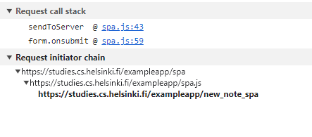

sequenceDiagram
participant browser
participant server
participant user

    browser->>browser: User writes note in text field
    browser->>browser: User clicks Save button
    browser->>server: POST https://studies.cs.helsinki.fi/exampleapp/new_note_spa {"content":"new note","date":"2023-12-11T18:31:06.437Z"}
    activate server
    server-->>browser: 200 OK (success response)
    deactivate server

